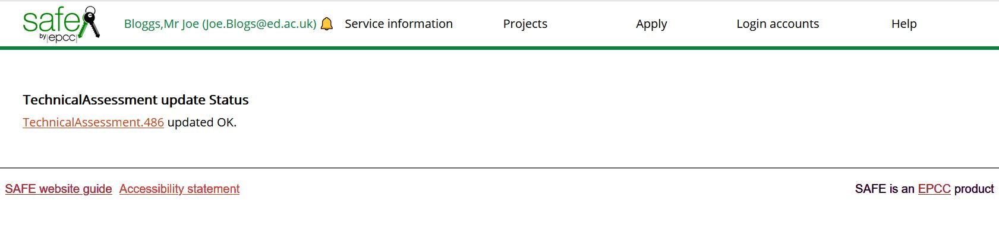
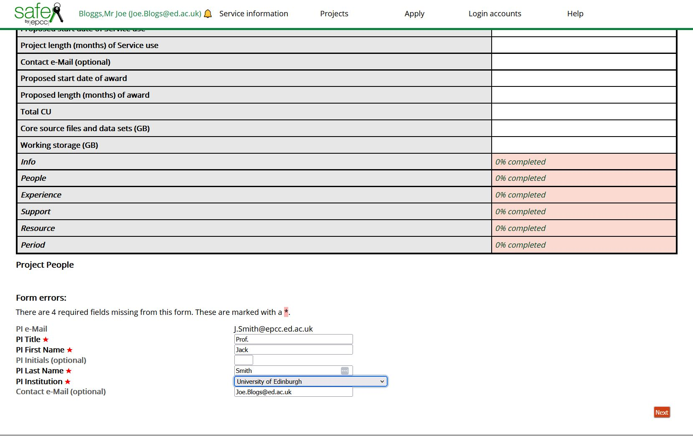
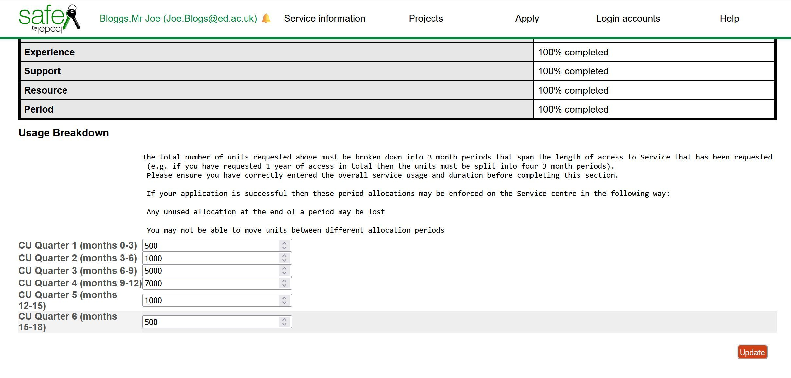
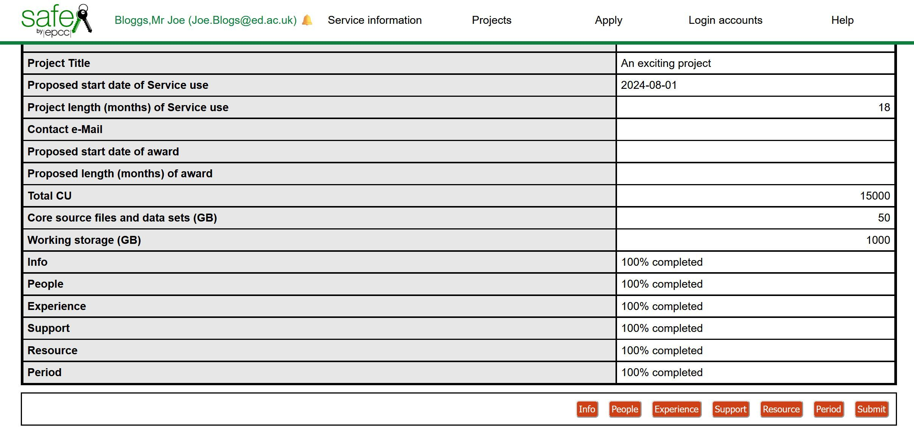

# Technical Assessments for Project applications

Technical Assessments can now be entered directly into SAFE.

If you do not already have a SAFE account, you should [create one](../safe-for-users/#how-to-register-on-safe).

[Log in to SAFE](../safe-for-users/#how-to-login-to-safe-and-overview-of-main-page)

Under the Apply menu, select Technical Assessments

Any TAs you have created previously will be shown.  

## Create a new Technical Assessment

To begin a new TA, click on Create.

Select the correct access Call from the drop-down list of available Calls.

Click Create.

Now enter the details about the project including the Title, Start date, Length and a brief summary of the project.

Click Update.

If all details were filled in then you should see TechnicalAssessment update Status,  TechnicalAssessment.NNN updated OK

The assessment is now entered into SAFE, but there are still many details to enter before it is complete.

Click on the `TechnicalAssessment.NNN` above to go back into the Technical Assessment and proceed to enter the remaining details.

## People

Click on the People button at the foot of the screen

The system will default to setting you as the proposed project PI, as you have entered the TA details, but if you are filling this in on behalf of the PI, enter their email address here instead of your own.

Click Next.

If the PI email entered previously does not yet have a SAFE account associated with it, then you must enter the details of the PI's Title, Name, Lastname and Institution

If you wish to receive correspondence and updates about the project and the TA approval, leave your email as the Contact email for this proposal.

Click Next.

Check that all the details entered are correct, then click Update.

You can always return to the form, if you wish, by selecting Technical Assessments under the Apply menu, and selecting the `TechnialAssessment.NNN` under ID

You can now see that the Info and People sections are 100% completed, but the remaining sections are 0% completed.

Click on the Experience button and fill in details of which other HPC resources your project members have used (if any) and brief details of the work that was run.  Please enter something into each box, even if it is to say "No other HPC used", or "n/a"

Click Update.

## Support

Click on Support, and fill in details about the main codes your project will be using, the software (compilers, libraries, tools) that you will need.
Briefly describe how you will port and optimize your code and any other support requirements.  Please enter something into each box.

Click Update.

## Resource

Click on Resource.

Enter the total compute resource you are requesting for this project - the units used will be determined by which HPC service you are applying to.

The Notional Cost can be calculated using the figures from the appropriate service:

- [ARCHER2](https://www.archer2.ac.uk/support-access/cu-calc.html)
- [Cirrus](https://www.cirrus.ac.uk/access/grant#notional-costs)

Enter the storage required for core source files and data sets (/home backed up storage)
Enter the storage required for working storage  (/work no backup, fast access storage)

Click Update.

## Period

Click on Period.

Because the compute resource allocation will be broken down into Allocation Periods spread throughout the lifetime of the project, in this section you indicate how you would like this split.

It is possible to have an even split between the allocation periods, but you should consider whether for example in the first part of the project you may be preparing your software and data and only performing small test runs, with the majority of the work taking place in the later periods, perhaps with the aim that most work will be completed before the final period when only a few small confirmation or re-runs will be required.

The split is entirely at the discretion of the PI, but should take into account that any unused allocation at the end of a period may be lost, as you will not generally be able to move units between different allocation periods.

Check that the sum of your allocation periods match the total compute resource requested.

Click Update.

## Submit

Once all sections are 100% completed then an additional Submit button will appear at the foot of the page.  Remember you must enter something into all the data entry fields, even if it is "n/a"

Once you are happy that all the details are complete and correct, click on Submit, then Update.

The Technical Assessment will now show as status "Submitted" and will be reviewed by the Service Team who will get back to you if they have any questions or comments.

## Seeing your Technical Assessments

You can still view the information that you entered, but cannot make further updates to the form.  In the event you realise there is a significant error, please contact the Support desk for the service you have applied to, with details, so they can amend your form if required.

If you have other project proposals, then you can go ahead and Create a new TechnicalAssessment for those.

You can always see your active (incomplete and submitted) Technical Assessments in SAFE under the Apply menu.

